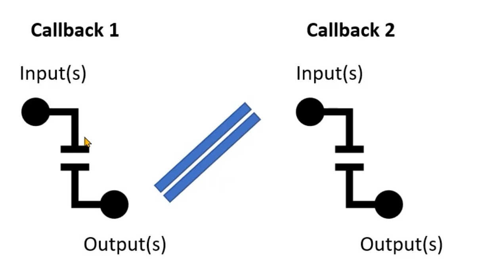

## What is Dash?
- Python Library For Building Web Applications
- Developed by Plotly Company
- Built on top of Plotly, Flash, and React
- It uses components based approach
- Two main components of Dash are layout and interactivity


## Building the Layout of Dashboaards
### HTML Components Overview
- Dash HTML component dash.html
- CSS is cascading to inline has the highest priority
```py
from dash import Dash, html
app.layout=html.Div(children=[
    html.H1(children='World Happiness Dashbard'),
    html.P(['This dashboard shows the happiness score.', html.Br(),
    html.A('World Happiness Report Data Source',
    href='https://worldhappiness.report',target='_blank')])
])
```
- Dash Core Component dash.dcc (html, js, and css)
- Example, dropdow, radio items, graphs, text input boxes, slider and rangeSlider
```py
line_fig=px.line(happiness[happiness['country']=='United States'],x='year', y='happiness_score',title='Happiness Score In the USA')
app.layout=html.Div(children=[
    dcc.RadioItems(options=region,value='North America'),
    dcc.Checklist(options=region,value=['North America']),
    dcc.Dropdown(options=country,value='North States'),
    dcc.Graph(figure=line_fig),
    html.Div(id='average_div')
])
```

## Making the Dashboard Interactive Using Callbacks
```py
# syntax of a callback function. Input and output are both the component of the dash
from dash import Input, Output
@app.callback(
    Output(component_id, component_property),
    Input(component_id, component_property)
) 
# the above are decorators. 
# component_id is the id or the variable of the component
# component_property = one of the properties of the component eg: Children of html.Div, figure of dcc.Graph
def function_name(inputs):
    # of of the function
    return output
```
## Making Callback with multiple inputs/outputs
```py
@app.callback(
    Output(component_id='happiness-graph', component_property='figure'),
    Output(component_id='average_div', component_property='children'),
    Input(component_id='country_dropdown', component_property='value'),
    Input(component_id='score_rank', component_property='value')
)
def change_happiness_graph(country_selected, score_or_rank):
    filtered_happiness = happiness[happiness['country']==country_selected]
    line_fig = px.line(filtered_happiness,x='year', y=f'{score_or_rank}',title=f'{score_or_rank} In the {country_selected}')
    selected_average = filtered_happiness[score_or_rank].mean()
    print(selected_average)
    return line_fig, f'The average for {country_selected} is {selected_average}' 
```

## Chaining callbacks Input and Outputs
- Output of one callback is the input of another callback


## Controlling callbacks with states (button)
- It is the input of the callback function
- Gets passed to the callback function, but the function is not triggered


## Customizing the Look of the Dashboard
- We can use CSS
- CSS Syntax. Element Selector and Declaration Block, just like regular css
```css
h1 {
    text-align: center;
    color: blue;
}
```
- Inline CSS, property name is camelCased
```py
html.H1('My Dashboard', style={'textAlign':'center', 'color':'blue'})
```
- Using external style sheets
```py
import dasb_bootstrap_components as dbc
app=Dash(external_stylesheets=[dbc.themes.CYBORG])
```
- Local style sheet is also available
- Creating a Grid Layout using bootstrap (dash-bootstrap-components). Just like a UI
- Using `Row` and `Col`

```py
import dash_bootstrap_components as dbc
dbc.Row([
    dbc.Col(html.Div('One of two Column')),
    dbc.Col(html.Div('Two of two Column'))

])
dbc.Row(html.Div('ONe ROw no Col'))
dbc.Row([
    dbc.Col(html.Div('One of two Column')),
    dbc.Col(html.Div('Two of two Column'))

])
```
- Building Navbars
```py
from dash import Dash, html
import dash_bootstrap_components as dbc


app=Dash(external_stylesheets=[dbc.themes.BOOTSTRAP])

navbar=dbc.NavbarSimple(
    brand='Soccer Players Dashboard',
    children=[
        html.Img(src='', height=20),
        html.A('Data Source', href='https://sofifa.com',
        target='_blank',
        style={'color':'black'})
    ],color='primary',fluid=True
)

app.layout=html.Div(navbar)
```

## RangeSlider Component
- One of the dash core component
```py
dcc.RangeSlider(
    id='simple-slider',
    min=0,
    max=100,
    value=[2,10],
    step=1,
    # mark is wha is being selected (key is position) and (value is label)
    mark={0:'0', 1:'1', 2:'2', 3:'3', 4:'4'}
)

```

## Choropleth Map
- Colored Geographical Area
- Plotly understand two letter abbreviation of US State
```py
px.choropleth(avg_price_electricity,
locations='US_State',
locationmode='USA-states',
color='Residential Price',
scope='usa',
color_continous_scale='reds')
```
## dcc.Graph Interactive Properties
- hoverData: hover over points
- clickData: click on points
- selectedData: select regions of points
- relayoutData: zoom

## Candlestick and DataTable
- Using pip install yfinance
- python classes that can represent parts of plotly figure
- Allows for more complicated chart than plotly express
```py
import plotly.graph_objects as go
```

## Tab and Tabs Components
```py
dcc.Tabs holds collection of dcc.Tab
```

## Interval Components
- Predefined time interval to update the dashboard automatically, eg 1 second, 5 minutes, 2 hours
- Useful in monitoring component
```py
dcc.Interval(id='chart-interval', interval=1000*60*15, n_intervals=0), 
# interval update every 15 minutes, n_interval is the times interval ran
dcc.Interval(id='table-interval', interval=1000*60, n_intervals=)
```
# plotly_dashboard
